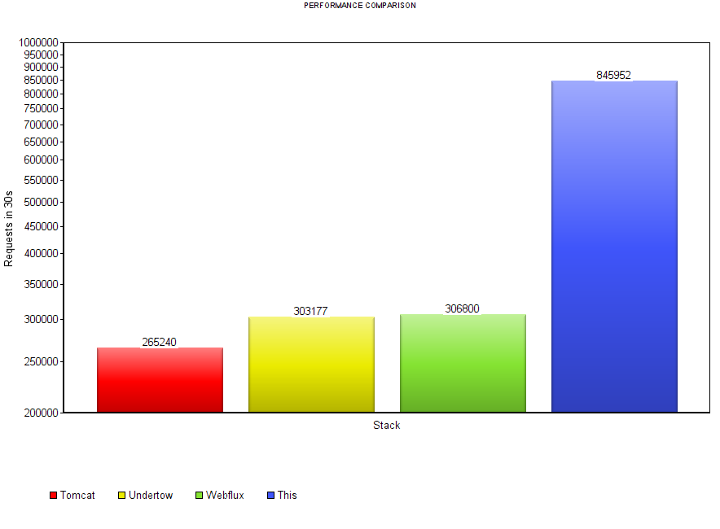

# Spring Boot + Netty

# Description

The repository is a **high**-performance tech stack based on [Spring Boot](https://projects.spring.io/spring-boot/) 
that using [Netty](https://netty.io/) instead of Spring Web MVC / Spring Webflux.


## Performance Comparison

### Environment

KVM, Ubuntu 16.04, 2048 MB RAM, 2 CPU

Run: `$ java -Xmx1024M -server -jar application.jar`

Test: `$ wrk -t12 -c400 -d30s --latency http://host/api/user/current`

### Tomcat

```
Running 30s test @ http://host/api/user/current
  12 threads and 400 connections
  Thread Stats   Avg      Stdev     Max   +/- Stdev
    Latency    54.66ms   64.39ms 996.17ms   92.02%
    Req/Sec   744.51    140.25     3.08k    85.77%
  Latency Distribution
     50%   42.26ms
     75%   65.72ms
     90%  105.89ms
     99%  275.51ms
  265240 requests in 30.06s, 53.93MB read
Requests/sec:   8822.80
Transfer/sec:      1.79MB
```


### Undertow

```
Running 30s test @ http://host/api/user/current
  12 threads and 400 connections
  Thread Stats   Avg      Stdev     Max   +/- Stdev
    Latency    66.80ms  121.30ms   1.94s    91.37%
    Req/Sec     0.87k   327.28     6.07k    91.60%
  Latency Distribution
     50%   27.18ms
     75%   77.43ms
     90%  172.98ms
     99%  505.67ms
  303177 requests in 30.04s, 51.47MB read
  Socket errors: connect 0, read 0, write 0, timeout 148
Requests/sec:  10090.98
Transfer/sec:      1.71MB
```

### Spring Reactive - Webflux

```
Running 30s test @ http://192.168.88.104:8080/api/user/current
  12 threads and 400 connections
  Thread Stats   Avg      Stdev     Max   +/- Stdev
    Latency    64.22ms  101.43ms   2.00s    89.74%
    Req/Sec     0.88k   332.80     7.93k    93.13%
  Latency Distribution
     50%   27.41ms
     75%   77.47ms
     90%  168.43ms
     99%  432.62ms
  306800 requests in 30.10s, 52.08MB read
  Socket errors: connect 0, read 0, write 0, timeout 36
Requests/sec:  10193.27
Transfer/sec:      1.73MB
```


### This

```
Running 30s test @ http://192.168.88.104:8080/api/user/current
  12 threads and 400 connections
  Thread Stats   Avg      Stdev     Max   +/- Stdev
    Latency    25.38ms   41.24ms 460.39ms   90.51%
    Req/Sec     2.38k   325.27     4.46k    88.33%
  Latency Distribution
     50%   12.09ms
     75%   18.72ms
     90%   63.93ms
     99%  215.51ms
  845952 requests in 30.05s, 129.08MB read
Requests/sec:  28151.60
Transfer/sec:      4.30MB
```

### Overview



So, this stack in 2.8 times faster than Undertow and Webflux and in 3.18 times faster than Tomcat.

The difference in rates becomes higher with more performance hardware.